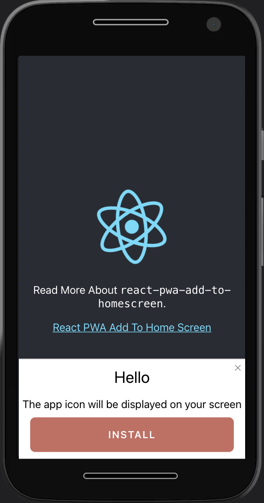

A React Component providing add-to-home-screen functionality for PWA on IOS (IPhone) and Chrome (Android).


# Contents
1. [What is it](#what-is-it)
2. [Usage](#usage)
3. [Options](#options)
4. [Example](#example)
5. [Licence](#licence)

## What is it?
`react-pwa-add-to-homescreen` inform user that your applications is a PWA and installable on the iOS and Android home screen

## Usage

Import component:
```
import { AddToHomeScreen } from 'react-pwa-add-to-homescreen';
```

Then add component to your app:
```
<AddToHomeScreen />
```

## Options

All props for components `AddToHomeScreen`

| Prop                            | Type     | Description                              |Default                                            |
| ------------------------        | -------- | --------------------------------         |--------------------------------                   |
| delayNotify?                    | number   | Show the message after some ms           | `0`                                             |
| skipFirstVisit?                 | boolean  | Show message only 30 minutes after the first visit to the site  | `true`                                            |
|                                 |          |                                          |                                                   |
| cookie?                         | object   | Cookie params                            | `{}`                                              |
| `cookie.name?`                  | string   | Set cookie name                          | `add-to-home-screen-pwa`                          |
| `cookie.expireDays?`            | number   | Days to be notified again                | `30`                                              |
| styles?                         | object   | Override or extend the styles applied to the component.| `{}`                                |
|                                 |          |                                          |                                                   |
| translate?                      | object   | Translate texts for notify components    | `{}`                                              |
| `translate.headline?`             | string   | Heading texts for notify components      | `''`                                              |
| `translate.bottomline?`           | string   | Bottom line texts for notify components  | `''`                                              |
| `translate.safariTapShare?`       | string   | Text tap share                           | `Tap "Share"`                                     |
| `translate.safariAddHomeScreen?`  | string   | Text Safari "Add to Home Screen"         | `select "Add to Home Screen"`                     |
| `translate.chromiumAddHomeScreen?`| string   | Text Chrome "Add to Home Screen"         | `Click "Add to Home Screen" in your browser menu` |
| `translate.chromiumInstall?`      | string   | Text Chrome Install                      | `The app icon will be displayed on your screen`   |
| `translate.buttonInstall?`        | string   | Text Chrome Button Install               | `install`                                         |


## Example

Run the example locally with command `npm run start:example`. It is then available under `http://localhost:3000`

## Licence
See the LICENSE file for more info.
